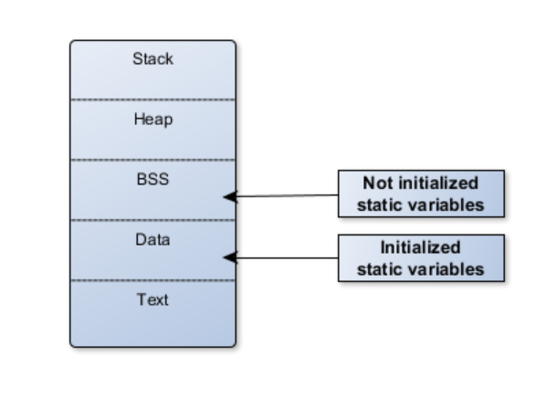

# Static-Variable
- Là biến chỉ khởi tạo 1 lần duy nhất và tồn tại suốt thời gian mà chương trình chạy.

**Example 1:**
~~~cpp
#include <stdio.h>

void count()
{
  static int a = 0;
  a++;
  printf("Gia tri cua a: %d", a);
}

int main()
{
  count();
  count();
  count();
  return 0;
}
~~~

Hiển thị ra màn hình:
~~~cpp
   Gia trị cua a: 1
   Gia tri cua a: 2
   Gia tri cua a: 3
~~~

**Example 2:**
~~~cpp
#include <stdio.h>

void count()
{
  static int a = 1;
  printf("Gia tri cua a: %d", a);
  a++;
}

int main()
{
  while(1){
    count();
  }
  return 0;
}
~~~

Hiển thị ra màn hình:
- **TH:** `Không sử dụng static`.
~~~cpp
   Gia trị cua a: 1
   Gia tri cua a: 1
   Gia tri cua a: 1
   ...
~~~
- **TH:** `Sử dụng static`.
~~~cpp
   Gia trị cua a: 1
   Gia tri cua a: 2
   Gia tri cua a: 3
   ...
~~~

## Vậy Global variable và Static variable khác nhau ở chỗ nào ?
- `Biến toàn cục (Global variable)`: Đây là biến được khai báo bên ngoài bất kì hàm nào và có thể truy cập mọi nơi trong chương trình. Biến toàn cục tồn tại suốt thời gian chạy của chương trình và `có thể sửa chữa giá trị từ bất kì hàm nào` => điều này dẫn đến việc quản lí dữ liệu.
- `Biến static`: Đây là biến được khai báo trong hàm hoặc khối mã, tồn tại trong suốt thời gian mà chương trình chạy. Tuy nhiên, `phạm vi của biến static chỉ nằm trong hàm và khối mã đã khai báo` => điều này có nghĩa rằng biến static không thể truy cập ngoài hàm và khối mã đó.

# Storage
Trong C, biến Static được lưu ở BSS hoặc DATA.

